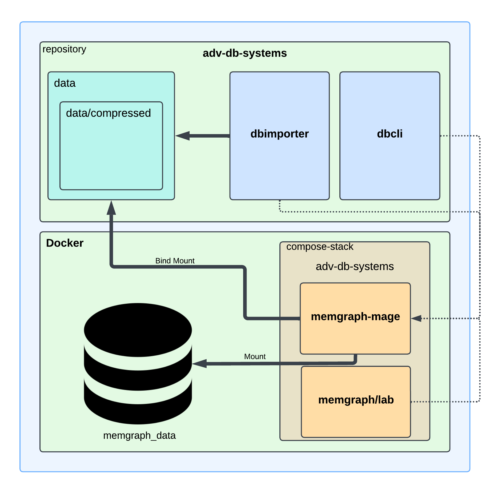

# [Advanced Db Systems](../README.md) - docs

## Dataset

1. Taxonomy_iw.csv.gz: This file contains 5,771,611 records representing a directed graph where each line describes a relationship between a category and a subcategory.
    - `"1880s_films","1889_films"` indicates that the category `"1880s_films"` contains the subcategory `"1889_films."`
2. Popularity_iw.csv.gz: This file has 952,453 records that provide information about the popularity of categories.
    - `"1889_films",34` indicates that the category `"1889_films"` has a popularity score of `34`.

## Initial tasks

1. Finds all children of a given node.
2. Counts all children of a given node.
3. Finds all grandchildren of a given node.
4. Finds all parents of a given node.
5. Counts all parents of a given node.
6. Finds all grandparents of a given node.
7. Counts how many nodes have unique names.
8. Finds nodes that are not subcategories of any other node.
9. Counts nodes for purpose 8.
10. Finds nodes with the largest number of children; there may be more than one.
11. Finds nodes with the smallest number of children (the number of children is greater than zero).
12. Changes the name of a given node.
13. Changes the popularity of a given node.
14. Finds all paths between two specified nodes, with edges directed from the first to the second node.
15. Counts nodes for purpose 14.
16. Calculates popularity in the neighborhood of a node at a specified radius; the parameters are the node's name and the neighborhood radius; neighborhood popularity is
    the sum of the popularity of the given node and all nodes belonging to the neighborhood.
17. Calculates popularity on the shortest path between two given nodes, according to the direction; popularity on the shortest path is the sum of the popularity of all
    nodes located on the shortest path.
18. Finds the directed path between two nodes with the highest popularity among all paths between those nodes.

---

## Technology

- [docker compose](https://docs.docker.com/compose/)
- [memgraph](https://memgraph.com/docs)
- [.net 8.0](https://dotnet.microsoft.com/en-us/download/dotnet/8.0)
- [python](https://www.python.org/)
- [bash](https://pl.wikipedia.org/wiki/Bash)
- [Cypher](https://en.wikipedia.org/wiki/Cypher_(query_language))

## Architecture



## [Requirements](../README.md#requirements-and-dependencies)

## [Installation and configuration](../README.md#installation-and-configuration-instructions)

## dbcli MAN

**RUNNING QUERIES WILL SAVE EXTENDED INFO TO `5f602e2f-ef92-46fa-9fe1-b865163f7a9a` IN YOUR TMP DIR**

1. `dbcli 1 <node_name>` For example -> `"1880s_films"`. Returns list of sub-category names for given category.
2. `dbcli 2 <node_name>` Returns count of sub-categories for given category.
3. `dbcli 3 <node_name>` Returns list of sub-category names for given category's sub-categories.
4. `dbcli 4 <node_name>` Returns list of parent category names for given category.
5. `dbcli 5 <node_name>` Returns count of parent categories for given category.
6. `dbcli 6 <node_name>` Returns list of parent category names for given category's parent categories.
7. `dbcli 7` Returns count of unique category names.
8. `dbcli 8` Returns list of category names that are not sub-categories of any other category.
9. `dbcli 9` Returns count of category names that are not sub-categories of any other category.
10. `dbcli 10 <limit>` Default `<limit>` -> `1` Returns list of tuples: `(category_name, n_of_children)` for categories with the largest number of sub-categories.
11. `dbcli 11 <limit>` Default `<limit>` -> `1` Returns list of tuples: `(category_name, n_of_children)` for categories with the smallest number of sub-categories.
12. `dbcli 12 <old_node_name> <new_node_name>` Returns new category name.
13. `dbcli 13 <node_name> <new_node_popularity>` Returns tuple `(category_name, old_popularity, new_popularity)` for given category
14. `dbcli 14 <first_node_name> <second_node_name> <n_of_hops>` Default `<n_of_hops>` -> `10` Returns list of paths (as category names) between two categories.
15. `dbcli 15 <first_node_name> <second_node_name> <n_of_hops>` Default `<n_of_hops>` -> `10` Returns count of different nodes existing on paths between two categories.
16. `dbcli 16 <node_name> <radius>` Radius is basically number of hops. Default: `<radius>` -> `1`. Returns: category name, category popularity, neighbor count,
    popularity of neighbor categories, neighbor popularity
17. `dbcli 17 <first_node_name> <second_node_name>` Returns popularity on shortest paths / paths.
18. `dbcli 18 <first_node_name> <second_node_name> <n_of_hops> <limit>` Default `<n_of_hops>` -> `15`, `<limit>` -> `1` (You can specify either none or all params).
    Returns path / list of paths with the highest.
    popularity

## Design and implementation process

Design of proposed solution is rather simplistic than complicated. There is no DI used. Services are rather static. Most work is done
by [memgraph](https://memgraph.com/docs).

- DbImporter is simple cli app that works as presented below. It uses parallel programming multithreading and not blocking neo4j driver to interact with memgraph. Tasks
  that are presented below are not executed in given order.

```
- unpacks gzipped data

- fixes records in popularity dataset that are inconsistent with taxonomy one 

- extracts unique categories from taxonomy dataset

- saves unique categories with generated ids to .csv that can be used by memgraph's importing tool
- uses memgraph's importing tool to insert unique categories

- saves relations between categories based on generated ids to .csv that can be used by memgraph's importing tool
- uses memgraph's importing tool to insert category relations

- saves popularity to .csv that can be used by memgraph's importing tool
- uses memgraph's importing tool to insert popularity values

- saves category -> popularity relations to .csv that can be used by memgraph's importing tool
- uses memgraph's importing tool to insert category -> popularity relations
```

- DbCli is simple cli app that works as presented below. It uses simple progress bar and keyboard listener to enhance user experience.

```
- starts keyboard listener and progress bar
- does task branching based on provided args
- executes non thread blocking query
- extracts returned records and query summary provided by non blocking neo4j driver
- extracts result string from obtained records
- append console output to task report
- saves query summary (with its result) to OS tmp dir
- prints report to the console
```

## Roles & Changelog

- experiments - Sokolowski
- investigation of inconsistencies in popularity dataset - Sokolowski
- implement db importer - Palucki
- update readme - Palucki
- implement and test [Cypher](https://en.wikipedia.org/wiki/Cypher_(query_language)) queries - Sokolowski
- implement and optimize cli results - Palucki
- Testing - Sokolowski
- Optimization ideas - Sokolowski
- update readme - Palucki
- prepare simple scripts for benchmark purposes - Palucki
- update readme - Palucki 

## Results

- [results](results.md)
- [benchmarks.html](../src/benchmarks/final/final.html) [benchmarks.ipynb](../src/benchmarks/final.ipynb)

## Self-assessment

- Example queries that you can use to grade implementation are presented in [results](results.md).
- provided [final](../src/benchmarks/final.ipynb) and [additional](../src/benchmarks/in-memory-analitycal.ipynb) benchmark results might give you brief
  understanding of solution quality.
- The important part you should focus on is dbImporter and its efficiency. With [Piotr Sokolowski](https://github.com/sokoloowski) pc it took less than 33s to import data
  using compiled solution on linux and 45s in docker environment.

Generally everything is made as simple as possible, but not simpler. This solution is good enough to say its very good.

## Strategies for future mitigation of identified shortcomings

- Maybe change mamgraph data import from csv one to cypherl
- Introduce lb to handle more tasks in one time
- Add unique to memgraph db ids
- Standardize names across db queries
- Introduce model to interact with db
- Split preprocessing from importing (longer import time but easier to maintain)
- Provide unit testing

---

## Incorrect Data Format

- [popularity_iw.csv fix](popularity.md)

## Compressed Data Folder

- [README.md](../data/README.md)