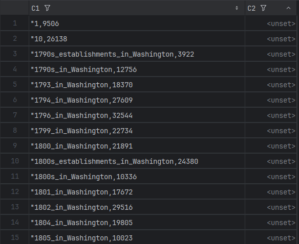

# [Advanced Db Systems docs](Readme.md) - popularity

- Some rows in [popularity_iw.csv.gz](../data/compressed/popularity_iw.csv.gz) are affected.
- We extracted those rows into: [bad-popularity-rows-raw.txt](popularity/bad-popularity-rows-raw.txt).
- We removed things after `,` and saved into [bad-popularity-rows.txt](popularity/bad-popularity-rows.txt).
- We removed 1, 10, and 1900 rows. First two are easy to fix, but last we just skipped [bad-popularity-rows-fixable.txt](popularity/bad-popularity-rows-fixable.txt).
- We extracted unique taxonomies from [taxonomy_iw.csv.gz](../data/compressed/taxonomy_iw.csv.gz).
- We mapped unique taxonomies with popularises based on
  `contains()` [unique-taxonomies-that-contains-bad-popularity-map.txt](popularity/unique-taxonomies-that-contains-bad-popularity-map.txt).

    ```python
    import numpy as np
    import pandas as pd
    
    taxonomy_df = pd.read_csv('taxonomy_iw.csv', header=None, names=['parent', 'child'], escapechar='\\')
    
    unique_values = {*taxonomy_df['parent'], *taxonomy_df['child']}
    unique_values = pd.DataFrame(unique_values, columns=['name']).set_index('name')
    
    print('unique value -> popularity name')
    with open('tmp_fixed.txt', 'r') as f:
        for line in f:
            line = line.strip()
            matching_indices = unique_values.index[unique_values.index.str.contains(line)]
            for index in matching_indices:
                print(f'{index} -> {line}')
    ```
- We observed that most of our bad popularises are matching only once, and those who matches more are already existing as correct ones
  in [popularity_iw.csv.gz](../data/compressed/popularity_iw.csv.gz).
    - `,_D.C.` and `_(state)`
        - 1890s_in_Washington,_D.C. -> 1890s_in_Washington
        - 1890s_in_Washington_(state) -> 1890s_in_Washington
    - or `_Territory` and `,_D.C.`
        - 1884_in_Washington_Territory -> 1884_in_Washington
        - 1884_in_Washington,_D.C. -> 1884_in_Washington

---

## Affected rows:


